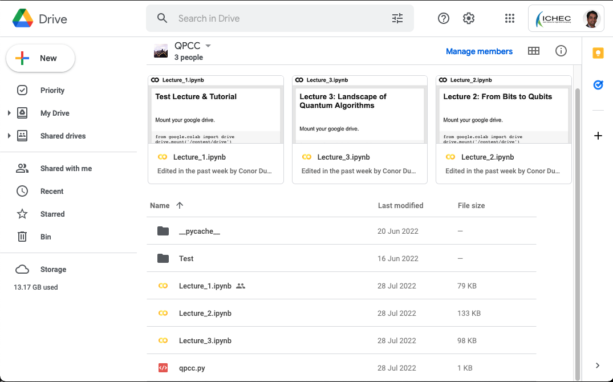
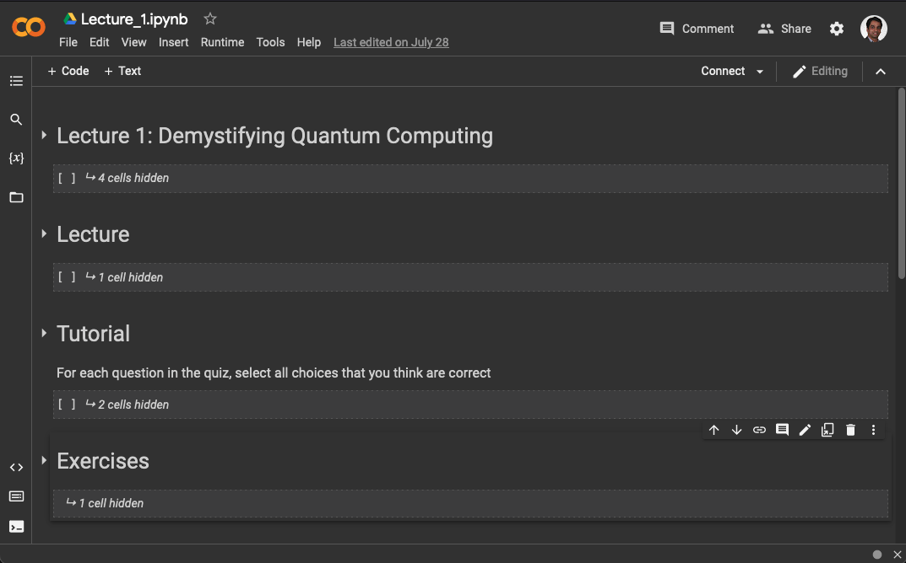

# Quantum Programming Certification Course (QPCC)

## Outline of course
As Executives or Technical Managers, if you are aware of quantum computing, but feel uninformed and underprepared to deal with its significance, then this programme is for you!

Quantum computing is seen as the next disruption in the world of computing and information processing. It will affect several sectors – public and private – including financial services, engineering and manufacturing, ICT, material sciences, pharmaceuticals, logistics and transport, environmental security, research organisations, public agencies, and Governments.

### Business Leaders
QPCC for Executives will inform you about the value proposition of quantum computing, value chain, ecosystem, capabilities, and development trends. You will be equipped to assess the impact of quantum computing for your sector and define suitable business strategies. The two sessions of this programme can be delivered back-to-back or spread over several days to suit the executives’ schedules.

### Tecnical Managers
QPCC for Managers will introduce practical skills including a landscape of quantum computing systems, algorithms, tools, and applications. The managers will be equipped to assess technology evolution, define use-cases, and create a roadmap for the necessary technical and skills development activities required for your organisations.

## Setting up your access
 1. Create a new Google account dedicated for your attendance of QPCC. This is reccomended for security and privacy, in contrast to using an existing account.
 2. Email your new Google account ID to qpcc@ichec.ie with the subject line "Google Drive for QPCC". We will create a new QPCC drive with the course content for you and share it using your new Google account.
 3. This new QPCC drive can be found under "Shared drives" in your Google drive associated with the new Google account.

 

 4. The course content can be fully accessed in this drive, which includes a Jupyter notebook for each module. 

 

 5. The Jupyter notebook for each module contains a lecture, tutorial and exercise content.

 

## Attending the course
 1. Open your QPCC drive from under the "Shared drives" in your new Google account.
 2. To attend a Lecture (recorded video), open the Module's associated Jupyter notebook. This will open a Colab notebook tab in your browser. Colab is Google's online platform for working with Jupyter notebooks. 
 3. In the notebook, you will see a collection of "cells" (blocks of code). You can run each cell by placing the curson within the cell and pressing Shift+Enter. It is important that you run the cells in the order presented (first to last).
 4. To prepare attending the Lecture, Tutorials and Exercises within the notebook, start by running the first two cells ("Mount your google drive", and "Install the required Python packages"). If you get an error or warning from either of these cells, run them again.

 

 5. To view the Lecture video, attend the tutorial questions and work through the exercises, run the corresponding cells for each of them.

 

## Support and assistance
Please write to qpcc@ichec.ie with any questions that you have or help you may need in relation to this course.
