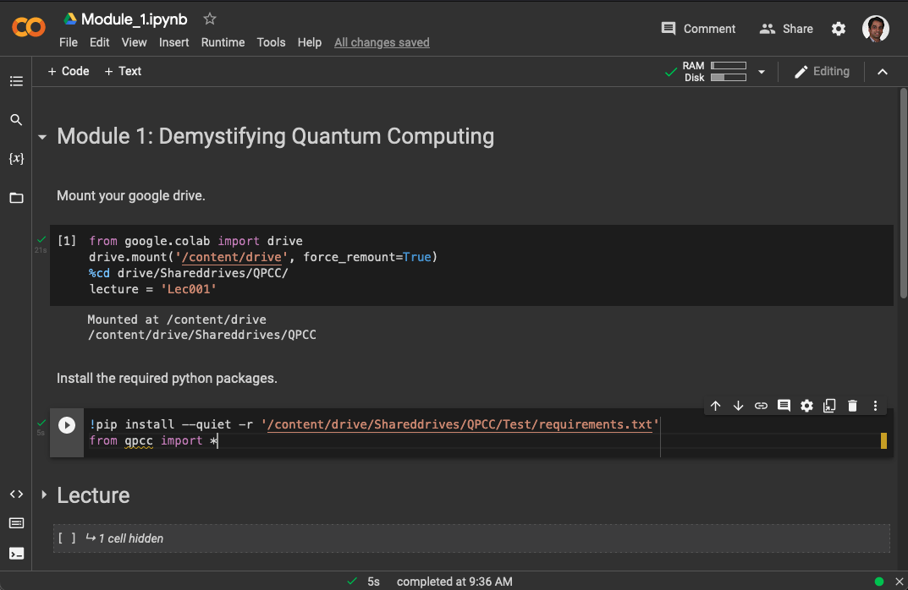

# Quantum Programming Certification Course (QPCC)

## Outline of course
As Executives or Technical Managers, if you are aware of quantum computing, but feel uninformed and underprepared to deal with its significance, then this programme is for you!

Quantum computing is seen as the next disruption in the world of computing and information processing. It will affect several sectors – public and private – including financial services, engineering and manufacturing, ICT, material sciences, pharmaceuticals, logistics and transport, environmental security, research organisations, public agencies, and Governments.

### Business Leaders
QPCC for Executives will inform you about the value proposition of quantum computing, value chain, ecosystem, capabilities, and development trends. You will be equipped to assess the impact of quantum computing for your sector and define suitable business strategies. The two sessions of this programme can be delivered back-to-back or spread over several days to suit the executives’ schedules.

### Tecnical Managers
QPCC for Managers will introduce practical skills including a landscape of quantum computing systems, algorithms, tools, and applications. The managers will be equipped to assess technology evolution, define use-cases, and create a roadmap for the necessary technical and skills development activities required for your organisations.

## Setting up your access
- Create a new gmail account(It is reccomended you do this in contrast to using an existing account) 
- email account name to qpcc@ichec.ie with the subject line "Google Drive for QPCC" and we will create a new QPCC drive for you
- This drive can be found in the "shared drives" directory in the Google drive associated with the new gmail account

- The course can be fully accessed in this drive, which includes a jupyter notebook for each module

## Attending the course
- Open your QPCC drive in the "shared drives" directory in your Google drive
- To attend a lecture, open the lecture's associated notebook. This will open a "colab" notebook tab in your browser. Colab is Google's jupyter notebook online platform. 
- Here you will see a collection of "cells", or blocks of code, which you can run using SHIFT+ENTER. It is important that you run the cells in the order presented.

- Upon running the first cell, you will be asked to give access, to your Google drive. Allow this.
- You can now run the following cells to view the lecture YouTube video, the tutorial quiz and the exercise questions

## Support and assistance

Please write to qpcc@ichec.ie with any questions that you have or help you may need in relation to this course.
