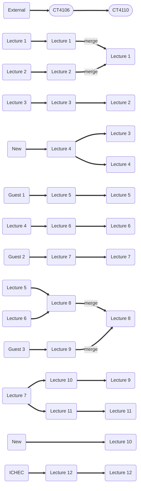

# CT4110
[](https://github.com/ICHEC/CT4106/actions/workflows/publish.yml)

## Structure
Below is the latest structure of the lectures, and evolution from previous iterations.




## Developer README

To locally render the HTML for the lecture notes:

1. Create a new environment
2. Install the required packages from `requirements.txt`
3. Using homebrew, install drawio to render some of the diagrams in the notes:
```{code-cell}
brew install --cask drawio
```
4. Build the book by running the following in the root directory (where `_config.yml` and `_toc.yml` are located):
```{code-cell}
jupyter-book build .
```
5. Copy and paste the generated link into a browser to view the notes.
