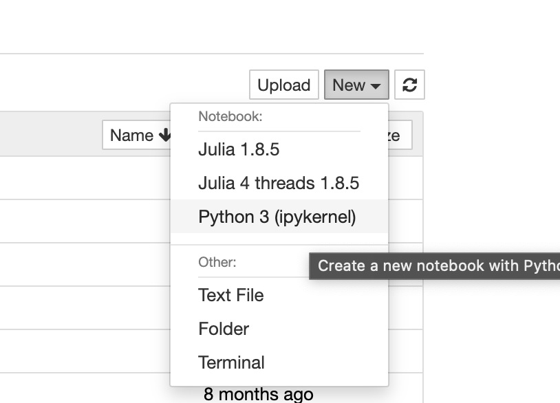
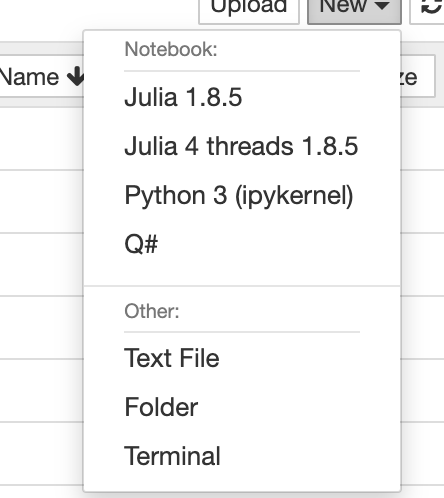

# Installing Anaconda

We will use anaconda installation for installing anything that we require for all of the notebook exercises.
Anaconda is self contained package manager to install softwares without interfering with operating system.
The link to install annaconda and installation instruction can be found [here](https://www.anaconda.com/products/distribution#Downloads).

---

## Instructions for installing Julia for YAO

### Using Conda 

1. Create an environment in conda each for julia
    ```bash
    conda create -n julia-env python=3 notebook
    ```
    Here we are asking conda to *create* a virtual environment named *julia-env* with python3 and install the package *notebook*. This is enough for either using visual studio code to run a python notebook, or run jupyter notebook.
---
2. Activate conda environment -
    ```bash
    conda activate julia-env
    ```
    This will load conda environment. Anything installed by pip or conda will be installed in this environment.
---
3. Now, we need to install julia, within the environment using conda. It's latest version is available in channel "conda-forge" (only). Run following to install julia in the environment.

    ```bash
    conda install -c conda-forge julia
    ```


If you want a separate julia installation other than conda, you can download from official julia download pare [here](https://julialang.org/downloads/), or use your operating system's package manager as bellow.

### system level installation

Since Julia has it's own package management, one may also just want to install at system level. 

On linux, most package managers have julia included, such as on Ubuntu you can install it by following terminal command -

```bash
sudo apt install julia
```

On MacOS one can install via `Homebrew`
```zsh
brew install julia
```

---

Once we have julia installed, we need to install julia kernel to be able to use them in python notebook. Julia does it's own package management, so we need to install the kernel through julia. Let's first launch julia by simply typing following in the terminal -
```bash
julia
```
This will run julia, and you will see julia prompt similar to python/ipython prompt. Within the prompt, now we run the following in sequence-
```julia
using Pkg; Pkg.add("IJulia")
```
This will install IJulia which provides ability to use julia kernel.

We further configure the kernel by following command -
```julia
using IJulia
installkernel("[Julia 4 cpu]", env=Dict("JULIA_NUM_THREADS"=>"4"))
```
The *installkernel* command is taking two arguments, first is a string, that is name of the kernel (visible when choosing a kernel in vscode/jupyter notebook) and next one defines a variable JULIA_NUM_THREADS which tells julia kernel how many cpu threads it can use. We choose 4, but it can be any positive number ≤ total number of cpu threads on your machine (laptop/desktop).

---
We just setup a functioning julia kernel. When you open any notebook, it shows an option in top right corner to *select a kernel*. So now you can go ahead and open a julia notebook in vscode. You should be able to see "Julia 4 cpu" (or whichever name you chose) as a julia kernel from the list of jupyter kernels. Select it, and run any julia code in the cell. Happy coding!



# Instructions for installing Q#
1. Create an environment in conda each for Q#
    ```bash
    conda create -n qsharp-env python=3 
    ```
    Here we are asking conda to *create* a virtual environment named *qsharp-env* with python3 and install the package *notebook*. This is enough for either using visual studio code to run a python notebook, or run jupyter notebook.
---
2. Activate conda environment -
    ```bash
    conda activate qsharp-env
    ```
    This will load conda environment. Anything installed by pip or conda will be installed in this environment.
---
3. Now, we need to install julia, within the environment using conda.Run following to install julia in the environment.

    ```bash
    conda install -c microsoft qsharp notebook
    ```
---
4. Now open jupyter notebook by running the following command you will find a Q# kernel to run Q# notebooks on in the New file section of Jupyter notebook

```bash
jupyter notebook
```




Copyright @ICHEC Team
