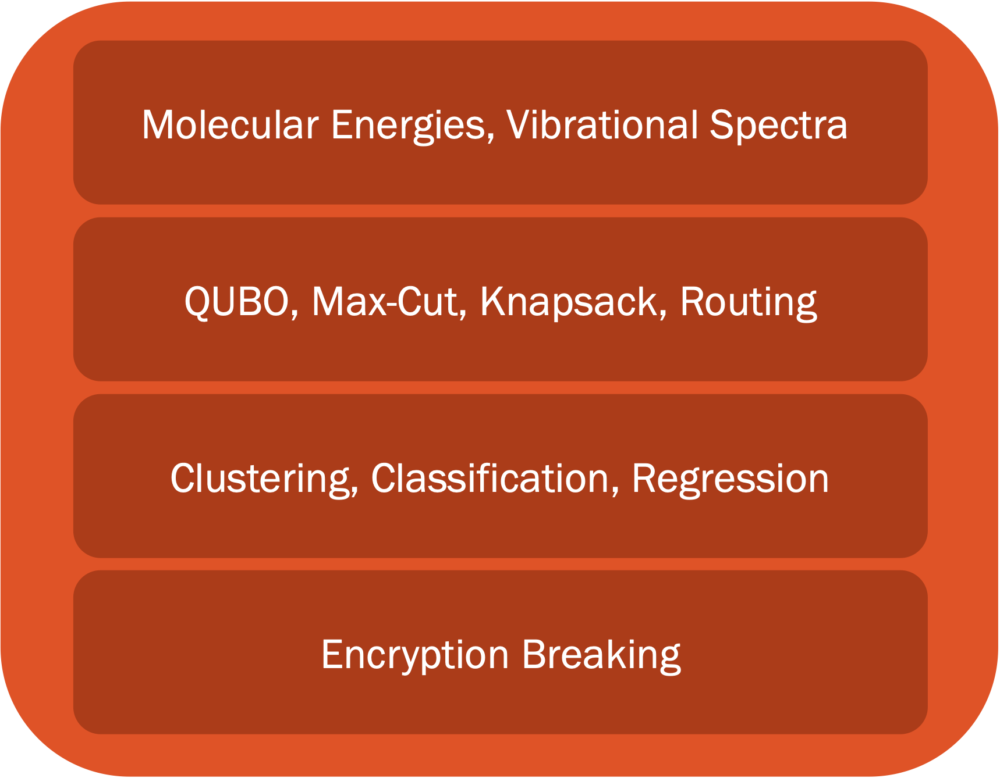
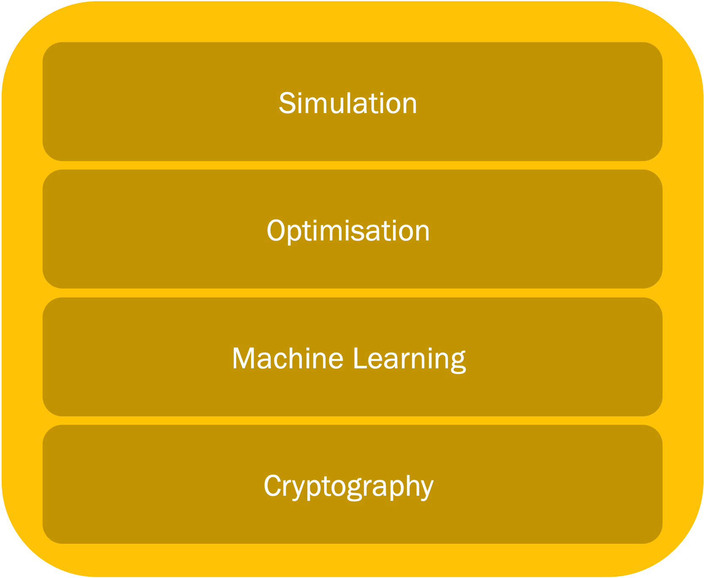

(lecture-10)=
# Lecture 10: Quantum Algorithms - I

```{warning} These lecture notes are a work in progress and are not a replacement for watching the lecture video, it's intended to be a supplementary reading after watching the lecture 
```

```{admonition} Learning Outcomes
:class: tip
In this lecture we will be taking a look at the landscape of quantum algorithms, and talk about two of the layers of the quantum stack shown in the right, namely the applications and quantum algorithms. The learning outcomes of this lecture will be the following : 
- Introduction to quantum algorithms and their applications.
- Grasping potential advantage of quantum algorithms.
- Understanding the requirements for the practical application of quantum algorithms.
```


```{image} ../prep/images/quant.png
:align: center
```

## Introduction

## Quantum stack

In the table below one can see some of the problems that can be solved with quantum algorithms (left) and also the type of the quantum algorithms suitable for solving them (right). 

|**Quantum Applications** | **Quantum Algorithms**|
|:---:|:---:|
|||

## Why do we need quantum computers?

Let's start with a quick recap of why we need quantum computers:

- One example of an application of QC is the Benzene molecule, which is a quantum system that is studied frequently in the oil gas and fuel industry. The Benzene molecule can be fully simulated with a 84 qubit quantum computer. This is something impossible to simulate even with the current best high-performance classical computers.

- Appart from simulation of quantum systems like the Benzene, it turns out that QC has even broader applications in areas like optimisation, machine learning and cryptography.

```{image} ./images/benzene.png
:align: center
```

- Qubits are informationally dense, meaning that we can encode 1 GB of information in just 33 qubits. A quantum computer with 272 qubits can represent more states than atoms are in the universe!
- The examples we have just presented assume noise-free qubits. In practice qubits have errors, which means that more qubits are needed in order to make computations.


## What is an algorithm? 

- An algorithm is a set of instructions that takes in some input and produces some output.
- A classic algorithm is based on the moving around of 0s and 1s, what we call classical hardware.
- One example of an algorithm is the google maps route optimisation algorithm, which finds the fastest route from point A to point B

```{image} ./images/maps.png
:align: center
```

### What is a quantum algorithm? 

- The definition of quantum algorithm is the same as the classical except for the fact that it is implemented using a quantum computing paradigm.

- Operating on quantum hardware allows the algorithm to take advantage of quantum mechanical properties such as superposition, entanglement or interference.

- For gate-based models for quantum computation, the input of the algorithm is encoded in an array of qubits, which are acted upon by a quantum circuit.

```{image} ./images/circuit.png
:align: center
```

- The result of applying a quantum algorithm is a probability distribution over the possible different outcomes, which are arrays of 0s and 1s representing the final state of each qubit.

```{image} ./images/outcome.jpg
:align: center
```

### Computational complexity

- Time and memory space are the two fundamental variables we are concerned with when comparing classical and quantum algorithms.

- These two metrics are encapsulated in the subject of computational complexity.

```{image} ./images/complexity.jpg
:align: center
```

- The image above represents an example of time/memory complexity with respect to some value N, that could be for example the number of variables of a given optimisation problem.

- In the graph we can see how the different lines scale in a different way with the N value. We would say in this case that the algorithm represented by the blue line is the most efficient. 

- The O shown in the graph legend is known as big O notation. It represents the limit behaviour of a function. As an example, this would mean that in the graph the orange line would be at most a multiple of N.

### Grover's algorithm


- Grover's algorithm was one of the earliest quantum algorihtms. It allows us to find elements in an unstructured database. What is more, Grover's algorithm is capable of doing this with a quadratic speedup over its classical counterpart, as we can see in the image below, with N being the number of elements in the database.

```{image} ./images/grover_1.jpg
:align: center
```

- The quantum algorithm works as follows:
    1. First we take a superposition of all the indexes of the elements in the database.
    2. An _oracle_ that can recognise the targeted element is applied to the superposition of elements
    3. Then the so-called _Grover operator_ is applied. This operator amplifies the probability of measuring the desired state. We can apply this operator several times in order to maximise our probability of success.
    4. In particular, by repeating this operator $\sqrt{N}$ times, we will end up with a high probability of finding our targeted element.

### Shor's algorithm 

- Shor's algorithm is one the most important quantum algorithms, as it allows to break RSA-encryption, as it is capable of performing integer factorisation.

- Factorising large numbers is computationally very expensive. Shor's algorithm is exponentially faster that any classical counterpart

- The algorithm works by using a trial and error process.
    ```{image} ./images/shor.jpg
    :align: center
    ```
    
    1. A random initial guess integer between 1 and the number we want to factorise in input.
    2. This input is sent into the quantum circuit, whose diagram (without entering into details) is shown in blue in the image above.
    3. We measure and if the result is not correct we repeat all the process again.


### Solving problems with early algorithms

- Most of the early quantum algorithms are based on the following techniques:
    1. Quantum amplitude estimation (Grover's algorithm).
    2. Quantum walks.
    3. Quantum phase estimation (Shor's algorithm).
    
```{drawio-image} ./images/early_algorithms.drawio
    :align: center
    :width: 100%
```

### Drawbacks of early quantum algorithms

- The early quantum algorithms that we have just seen are not really used in practice.

- This is due to the presence of decoherence and errors in the qubits of actual devices. As the number of qubits increase, the errors increase in our quantum algorithm. As an example, as we consider larger and larger lists, the number of qubits needed for Grover search algorithm would increase, increasing as well the errors of the circuit.

- Thus a distinction is made between what is called _logical qubits_, which are ideal noise-free qubits and the _physical qubits_, which are the real qubits with noise.

- In order to mitigate this errors, we can use error mitigation techniques that imply adding more physical qubits. This way, in order to have the equivalent to 100 logical qubits, we would need 1,000,000 physical qubits with errors.

- Another solution to face the errors is to modify the algorithms and try to make them shallower and using less qubits.


## Wrap-up
Learning outcomes achieved:
- Introduction to early quantum algorithms
    - Searching
    - Cryptography
- Grasping potential advantage of quantum algorithms
