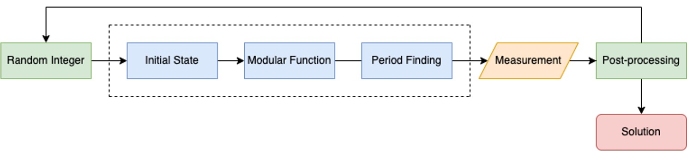
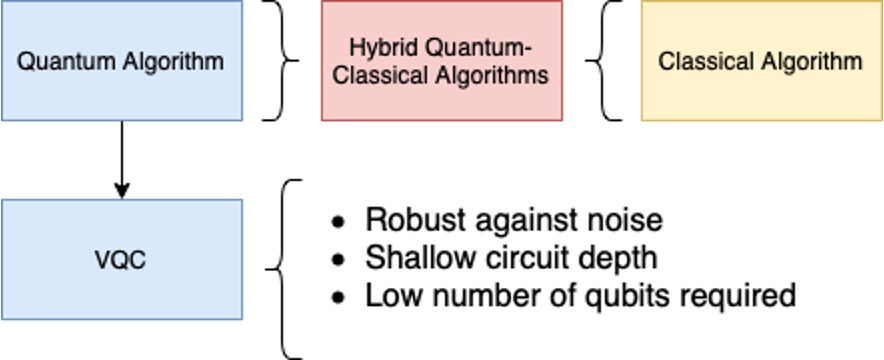
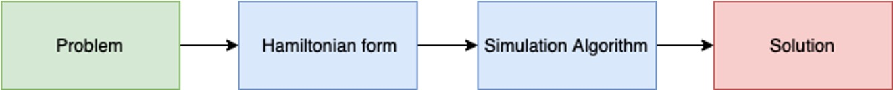
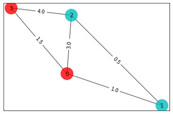
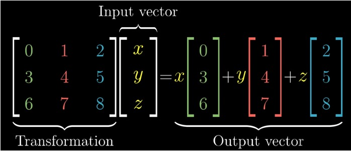
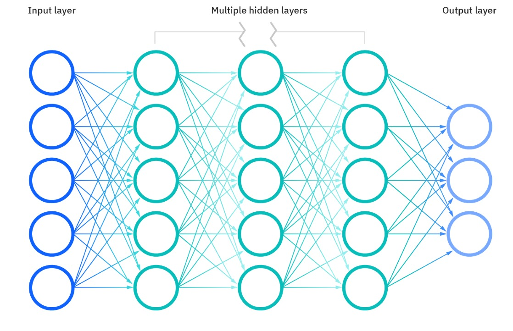
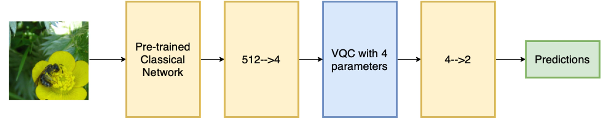

# Landscape of quantum algorithms

### Learning Outcomes

In this lecture we will be taking a look at the landscape of quantum algorithms. The learning outcomes of this lecture will be the following : 
<ul>
    <li> Introduction to quantum algorithms and their applications. </li>
    <li> Grasping potential advantage of quantum algorithms. </li>
    <li> Understanding the requirements for the practical application of quantum algorithms. </li>
</ul>

### Agenda

<ul>
    <li> Why do we need quantum computers?</li>
    <li>What is a quantum algorithm?</li>
    <li>Early quantum algorithms</li>
    <ul>
        <li>Grover's algorithm</li>
        <li>Shor's algorithm</li>
        <li>Drawbacks</li>
    </ul>
    <li>NISQ (Noisy Intermediate-Scale Quantum) algorithms</li>
    <ul>
        <li>Variational quantum algorithms</li>
        <li>Map of NISQ algorithms</li>
        <li>Landscape of quantum algorithms</li>
    </ul>
    <li>Simulation quantum algorithms</li>
    <li>Optimisation quantum algorithms</li>
    <li>Machine learning quantum algorithms</li>
</ul>

### Quantum stack
<table style="width:100%">
<tr>
<td width="60%">
In this lecture we will be talking about two of the layers of the quantum stack shown in the right, namely the applications and quantum algorithms.
</td>
<td width="40%">  </td>
</tr>
</table>

In the table below one can see some of the problems that can be solved with quantum algorithms (left) and also the type of the quantum algorithms suitable for solving them (right). 
<table style="width:100%">
<tr>
<td width="50%">

</td>
<td width="50%">
</td>
</tr>
</table>

### Why do we need quantum computers?

Let's start with a quick recap of why we need quantum computers:
<ul>
    <li> One example of an application of QC is the Benzene molecule, which is a quantum system that is studied frequently in the oil gas and fuel industry. The Benzene molecule can be fully simulated with a 84 qubit quantum computer. This is something impossible to simulate even with the current best high-performance classical computers.</li>
    <li>Appart from simulation of quantum systems like the Benzene, it turns out that QC has even broader applications in areas like optimisation, machine learning and cryptography.
    

    
    

    </li>
    <li> Qubits are informationally dense, meaning that we can encode 1 GB of information in just 33 qubits. A quantum computer with 272 qubits can represent more states than atoms are in the universe!</li>
    <li>The examples we have just presented assume noise-free qubits. In practice qubits have errors, which means that more qubits are needed in order to make computations.</li>
</ul>

### What is an algorithm? 

<ul>
<li>An algorithm is a set of instructions that takes in some input and produces some output.</li>
<li>A classic algorithm is based on the moving around of 0s and 1s, what we call classical hardware.</li>
<li>One example of an algorithm is the google maps route optimisation algorithm, which finds the fastest route from point A to point B</li>

</li>
</ul>

### What is a quantum algorithm? 

<ul>
<li>The definition of quantum algorithm is the same as the classical except for the fact that it is implemented using a quantum computing paradigm.</li>
<li>Operating on quantum hardware allows the algorithm to take advantage of quantum mechanical properties such as superposition, entanglement or interference.</li>
<li>For gate-based models for quantum computation, the input of the algorithm is encoded in an array of qubits, which are acted upon by a quantum circuit.

</li>
<li> The result of applying a quantum algorithm is a probability distribution over the possible different outcomes, which are arrays of 0s and 1s representing the final state of each qubit.

</li>
</ul>

### Computational complexity

<ul>
<li>Time and memory space are the two fundamental variables we are concerned with when comparing classical and quantum algorithms.</li>
<li>These two metrics are encapsulated in the subject of computational complexity.

</li>
<li>The image above represents an example of time/memory complexity with respect to some value N, that could be for example the number of variables of a given optimisation problem.</li>
<li>In the graph we can see how the different lines scale in a different way with the N value. We would say in this case that the algorithm represented by the blue line is the most efficient. 
<li>The O shown in the graph legend is known as big O notation. It represents the limit behaviour of a function. As an example, this would mean that in the graph the orange line would be at most a multiple of N.</li>
</ul>

### Grover's algorithm

<ul>
<li>Grover's algorithm was one of the earliest quantum algorihtms. It allows us to find elements in an unstructured database. What is more, Grover's algorithm is capable of doing this with a quadratic speedup over its classical counterpart, as we can see in the image below, with N being the number of elements in the database.

</li>
<li>The quantum algorithm works as follows:
    <ol>
    <li> First we take a superposition of all the indexes of the elements in the database.</li>
    <li> An <i>oracle</i> that can recognise the targeted element is applied to the superposition of elements.</li>
    <li> Then the so-called <i>Grover operator</i> is applied. This operator amplifies the probability of measuring the desired state. We can apply this operator several times in order to maximise our probability of success.</li>
    <li> In particular, by repeating this operator $\sqrt{N}$ times, we will end up with a high probability of finding our targeted element.</li>
    </ol>
</li>
</ul>

### Shor's algorithm 

<ul>
<li> Shor's algorithm is one the most important quantum algorithms, as it allows to break RSA-encryption, as it is capable of performing integer factorisation.</li>
<li>Factorising large numbers is computationally very expensive. Shor's algorithm is exponentially faster that any classical counterpart</li>
<li> The algorithm works by using a trial and error process.
    

    
    

    <ol>
    <li>A random initial guess integer between 1 and the number we want to factorise in input.</li>
    <li> This input is sent into the quantum circuit, whose diagram (without entering into details) is shown in blue in the image above.</li>
    <li> We measure and if the result is not correct we repeat all the process again.</li>
    </ol>
</li>
</ul>

### Solving problems with early algorithms

<ul>
<li> Most of the early quantum algorithms are based on the following techniques:
<ol>
<li> Quantum amplitude estimation (Grover's algorithm).</li>
<li> Quantum walks.</li>
<li> Quantum phase estimation (Shor's algorithm).</li>
</ol>
    

    
    

</li>
</ul>

### Drawbacks of early quantum algorithms

<ul>
<li> The early quantum algorithms that we have just seen are not really used in practice.</li>
<li> This is due to the presence of decoherence and errors in the qubits of actual devices. As the number of qubits increase, the errors increase in our quantum algorithm. As an example, as we consider larger and larger lists, the number of qubits needed for Grover search algorithm would increase, increasing as well the errors of the circuit.</li>
<li> Thus a distinction is made between what is called <i>logical qubits</i>, which are ideal noise-free qubits and the <i>physical qubits</i>, which are the real qubits with noise.
<li>In order to mitigate this errors, we can use error mitigation techniques that imply adding more physical qubits. This way, in order to have the equivalent to 100 logical qubits, we would need 1.000.000 physical qubits with errors. </li>
<li>Another solution to face the errors is to modify the algorithms and try to make them shallower and using less qubits.  </li>
</ul>

### NISQ era and algorithms

<ul>
<li>NISQ stands for Noisy Intermediate Scale Quantum. This describes the current state of quantum hardware, with approximately 100 qubits, subject to noise.</li>
<li>To work with this circuit, shallow quantum algorithms with low number of qubits are needed. In most of the cases, this algorithms are embbeded to a classical algorithm, resulting on <i>hybrid classical-quantum algorithms.</i></li>
<li>The most common type of NISQ algorithms are the variational quantum circuits (VQCs), which are quantum circuits that contain classical parameters that need to be classically optimised.</li>
    

    
    

</ul>

### Variational quantum algorithms

<ul>
<li>One can think as VQC's as trainable quantum circuits. Different problems will require different gates and parameter structure.</li>
<li>In order to train the variational parameters, we will measure the output of the circuit, sent it to a cost function (which is problem-dependant) and perform an optimisation step (like stochastic gradient descent) to update the parameters. We can repeat this process until we get a set of parameters that make the circuit output the desired solution.
    

    
    

</li>
<li>We can use VQCs to solve simulation, optimisation and machine learning problems.</li>
<li>Even though VQCs by themselves doesn't allow us to solve large problems, its integration in classical pipelines may be of interest in the near future.</li>
</ul>

### Map of NISQ algorithms

In the diagram below we can see some of the applications of NISQ algorithms. We will cover the different areas of application (simulation, optimisation and machine learning) in the following sections.
    

    
    

### Quantum algorithms and applications

In the diagram below we can see another diagram showing the problems solved by NISQ algorithms and the sectors in which these algorithms are useful. As examples, the maximum-cut proble is frequent in the tech sector, like in the study of networks. On the other hand fluid dynamics is present in aerospace engineer, or the travelling salesman problem in logistics. 

### Simulation 

<ul>
<li>Simulation of quantum systems aims to predict the behaviour of a complex physical system such as a molecule. It remains extremely difficult for a classical computer to simulate this kind of systems.</li>

<li>These complex systems are generally composed of interacting quantum objects, which can be simulated on quantum computers by directly mapping these objects onto qubits.</li>
<li> To run a quantum computing simulation algorithm, we have to encode the problem we are solving in a mathematical function called Hamiltonian, which can be thought as the energy model for the system. After encoding the Hamiltonian in the qubits of our circuit, we can apply one of our simulation algorithms to reach the desired solution. 

</ul>

### Advantage of NISQ simulation algorithms

<ul>
<li> Quantum systems like molecules are easy to simulate with other quantum systems (qubits are quantum systems!), as they maintain the same properties and follow the same physical laws.</li>
<li> As quantum systems are very complex, they are impossible to simulate classically due to memory constraints when the system size exceeds $N=50$.</li>
<li>This however doesn't mean that any problem computation done with more than 50 qubits can't be solved classically using alternative methods.</li>
</ul>

### Simulation map 

<ul>
<li>Above is shown the mapping between quantum simulation algorithms and some of their applications in specific industries.</li>
<li>Algorithms are shown in red, applications in green, and more abstract problems in blue.</li>
<li>Algorithms can solve a set of particular problems, shown in blue, which can be used for a particular application on an industry.</li>
<li>As we see, the generic simulation algorithms are the Variational Quantum Eigensolver (VQE) and the Quantum Approximate Optimsation Algorithm (QAOA). The objective of both algorithms is to measure the energies of some Hamiltonian.</li>
</ul>

### The variational quantum eigensolver

<ul>
<li>Looking back at the Benzene molecule we saw at the beginning of the lecture, let's see how we can use the VQE to find its minimum energy state in a process called eigensolving.</li>
<li>We can encode the Benzene molecule in a Hamiltonian in which we can the apply the VQE to.</li>
<li>Each of our qubits will represent one component of the system. We can apply evolution operators to these qubits, which will contain variational quantum parameters, that will be optimised until we find the desired minimum energy.</li>

</ul>

### PFAS molecule destruction

<ul>
<li>An important use-case of the VQE is the study of PFAS (per-and polyfluoroalkyl) molecule destruction. These molecules are used as heat, water and oil resistant coatings in many areas.</li>
<li>These molecules are present in many materials, and have the inconvenient that are toxic to human bodies and they can easily contaminate water. Thus, there is an interest in chemical degradation and destruction of these molecules. In order to break these molecules we need to be able to simulate their energies, something that can be done with the VQE.</li>
</ul>

### Optimisation

<ul>
<li>Optimisation is a branch of mathematics and computer science that deals with finding the best solution (maximum or minimum) of some problem, by performing iterations of a given algorithm.</li>
<li>One may want to minimise quantities like energy use or manufacturing time, or maximise profit for example.</li>
<li>It turns out that the VQCs we have seen before are promising candidates to solve optimisation problems.</li>
<li>An optimisation problem can be encoded on a VQC. The quantity we want to maximise/minimise would therefore be a function of the output when measuring the VQC. We can update the variational parameters of the VQC (using a classical optimiser) in successive iterations until the desired solution for our optimisation problem is attained.

</li>
</ul>

### Optimisation map

<ul>

<li>Above is shown the mapping between quantum optimisation algorithms and some of their applications in different industries. </li>
<li> When comparing this map with the one we presented before for simulation, we seen than the Grover adaptative search algorithm has been added now. This algorithm is a NISQ variation of Grover's algorithm, where Grover search is iteratively applied and classically optimised to find good solutions.</li>
<li>As we see, the applications and sectors are different when we compare them to the simulation map.</li>
</ul>

### Max-cut problem

<ul>
<li>A graph is a structure made up of various nodes that have weighted connections (edges) between them. They can be used to model different problems and scenarios. For example social media users can be modelled using a graph, where its edges represent the influence between different users.</li>
<li>The Max-cut problem aims to do a binary partition of the nodes of the graph so that the sum of the weights of the connections between the two sets is maximised. In the image below we can see how the graph's nodes were divided in two sets: one conatining nodes 0,3 and the other containing nodes 1,2.

</li>
<li>The Max-cut problem can be easily mapped to what is called an Ising Hamiltonian, which can be easily encoded and optimised on quantum computers.</li>
<li>The Max-cut problem has applications in many areas including clustering, or graph and electrical design. It is often used as benchmnarking for evaluating optimisation techniques.</li>
</ul>

### Travelling-salesman problem

<ul>
<li>The travelling-salesman problem is another famous optimisation problem. Given a list of cities represented with nodes on a graph, and its distances represented by the weighted edges, the objective of this problem is to find the shortest possible route, so that each city is visited just once, and the starting and ending point of the route is the same.</li>
<li>Similarly to Max-cut, this problem can be easily mapped to an Ising hamiltonian and optimised in a quantum computer. In the image below we can see the graph representing the problem (left) and the shortest optimal route (right).

</li>
<li>This problem has different applications in many areas, being finance and marketing among the most notable ones.</li>
</ul>

### Optimisation using annealing

<ul>
<li>Until now we have mainly focused on VQCs, a type of quantum algorithm that is meant to be implemented on a gate-based quantum computer. However, there exist other types of quantum computer architectures that are good when it comes to solve optimisation problems.</li>
<li>One of these architectures is what is called quantum annealing. This type of quantum computers are only capable of solving problems that can be encoded as Ising Hamiltonians.</li>
<li>While this is a limitation, it is compensated by the fact that annealers have more than 5,000 qubits available, meaning that the size of the problems that can be solved is much larger when compared to gate based computers.

 </li>
</ul>
<li>One of the most promising quantum annealing applications is portfolio optimisation.</li>

### Machine learning

<ul>
<li>The primary goal of machine learning is to develop models that can generalize well to new, unseen data, allowing them to make accurate predictions or decisions in various situations.</li>
<li>A simple example of a machine learning task is image classification. In the image below we can see bees and ants. One machine learning model (which is well trained), would be capable of distinguishing between the bees and ants in the image.

</li>
</ul>

### Advantage of NISQ machine learning algorithms

<ul>
<li>We can find different computational bottlenecks in a classical machine learning workflow. One example of this is matrix-vector multiplication, a seemingly simple operation which consumes a lot of computation power when the matrices are very large.

</li>
<li>Other examples of computationally expensive tasks appearing in machine learning tasks are Fourier transforms, diagonalising matrices or solving linear systems of equations.</li>
<li>With quantum algorithms it is thought that we can get an speed-up in some of these tasks.</li>
</ul>

### Machine learning map 

<ul>
<li>Above is shown the mapping between quantum machine learning algorithms and some of their applications in different industries.</li>
<li>When compared to the previous maps we have shown, it can be seen that VQCs are still important here, and also the quantum embedding kernels, which are based on classical kernel methods but implemented on a quantum computer.</li>
<li>Among the applications we find neural networks (we can use VQCs as one neural network layer) or quantum generative adversarial methods (quantum GANs), that can be used to generate data that resembles the original data used for training. These are especially important in fraud detection in finance industry.</li>
</ul>

### Classical neural networks 

<ul>

<li>A classical neural network is composed of multiple layers of transformations, governed by certain weights and parameters, which are represented in nodes in the image. </li>
<li>A vector is input to the networks and is transformed multiple times until we get the output vector.</li>
<li>The parameters of the network are trained to minimise a cost function that will depend on the quantity that we are measuring</li>
</ul>

### Quantum neural network

<ul>
<li>A quantum neural network is a neural network where one of more of the layers is a VQC.</li>
<li>As we seen in the previous section, each layer of the network is governed by a set of parameters. When a layer is a VQC, these parameters will be the variational parameters appearing in the quantum circuit, that will be optimised during the training phase.</li>
<li>What the benefits are of having a VQC as layer is still an open question in quantum machine learning.</li>

</ul>

### Quantum tranfer learning 

<ul>
<li>Quantum transfer learning is a technique that falls within the field of quantum neural networks.</li>
 <li>This technique involves using a pre-trained classical neural network, and substituting one of the layers of the networks by a VQC, as we can see in the image.</li>
 <li>The VQC variational parameters are trained using the output of the pre-trained classical neural network to get the desired result.</li>
 

</ul>

### Quantum machine learning example 

<ul>
<li>Let's return to the image processing task on bees and ants that we saw before to see an example of application of quantum machine learning. </li>
<li>As we see in the diagram, we input an image encoded in 512 pixeles to a pre-trained neural network on image classification. </li>
<li>After that a layer is applied to reduce dimensionality, and its output is sent to a VQC with 4 parameters. Then, another layer is applied to get a 2-dimensional vector with out predictions</li>

</ul>

### Anomaly detection with qGANs

<ul>
<li>As we have seen before, GANs have seen great success in anomaly detection.</li>
<li>A GAN consists of two neural networks, a generator and a discriminator. The generator aims to to create a dataset which is indistinguishable from the training data provided, and the discriminator aims to succesfully distinguish between these two datasets.</li>
<li>After training these two networks, the discriminator will be capable of detecting anomalies on unseen data.</li>
<li>The classical GANs have shown limitations in training phase and sampling procedure. That is why in qGANs the classical generator is replaced with a VQC to try to overcome this limitations.</li>

</ul>

### Wrap-up
Learning outcomes achieved:
<ul>
<li>Introduction to early quantum algorithms
<ul>
    <li>Searching</li>
    <li>Cryptography</li>
</ul></li>
<li>Grasping potential advantage of quantum algorithms</li>
<li>Introduction to NISQ algorithms and their applications in different areas
<ul>
    <li>Simulation</li>
    <li>Optimisation</li>
    <li>Machine learning</li>
</ul></li>
</ul>