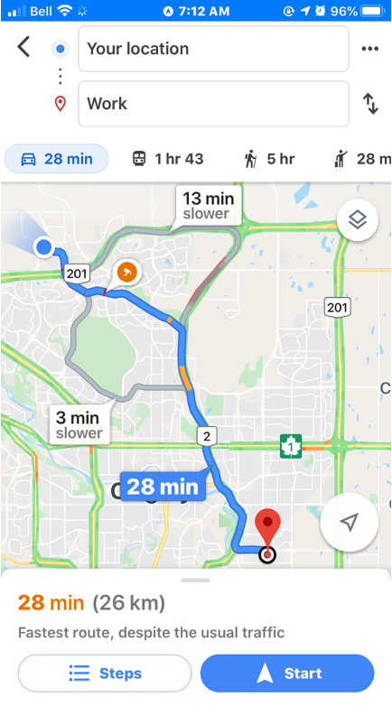
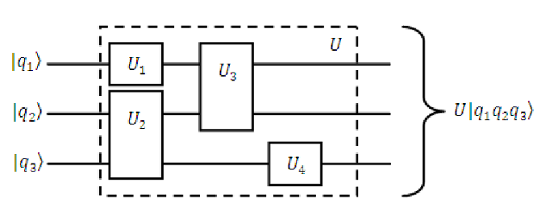
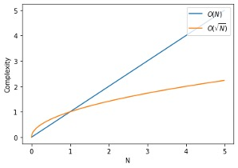

# Landscape of quantum algorithms

### Learning Outcomes

In this lecture we will be taking a look at the landscape of quantum algorithms. The learning outcomes of this lecture will be the following : 
<ul>
    <li> Introduction to quantum algorithms and their applications. </li>
    <li> Grasping potential advantage of quantum algorithms. </li>
    <li> Understanding the requirements for the practical application of quantum algorithms. </li>
</ul>

### Agenda

<ul>
    <li> Why do we need quantum computers?</li>
    <li>What is a quantum algorithm?</li>
    <li>Early quantum algorithms</li>
    <ul>
        <li>Grover's algorithm</li>
        <li>Shor's algorithm</li>
        <li>Drawbacks</li>
    </ul>
    <li>NISQ (Noisy Intermediate-Scale Quantum) algorithms</li>
    <ul>
        <li>Variational quantum algorithms</li>
        <li>Map of NISQ algorithms</li>
        <li>Landscape of quantum algorithms</li>
    </ul>
    <li>Simulation quantum algorithms</li>
    <li>Optimisation quantum algorithms</li>
    <li>Machine learning quantum algorithms</li>
</ul>

### Quantum stack
<table style="width:100%">
<tr>
<td width="60%">
In this lecture we will be talking about two of the layers of the quantum stack shown in the right, namely the applications and quantum algorithms.
</td>
<td width="40%">  </td>
</tr>
</table>

In the table below one can see some of the problems that can be solved with quantum algorithms (left) and also the type of the quantum algorithms suitable for solving them (right). 
<table style="width:100%">
<tr>
<td width="50%">

</td>
<td width="50%">
</td>
</tr>
</table>

### Why do we need quantum computers?

Let's start with a quick recap of why we need quantum computers:
<ul>
    <li> One example of an application of QC is the Benzene molecule, which is a quantum system that is studied frequently in the oil gas and fuel industry. The Benzene molecule can be fully simulated with a 84 qubit quantum computer. This is something impossible to simulate even with the current best high-performance classical computers.</li>
    <li>Appart from simulation of quantum systems like the Benzene, it turns out that QC has even broader applications in areas like optimisation, machine learning and cryptography.
    

    
    

    </li>
    <li> Qubits are informationally dense, meaning that we can encode 1 GB of information in just 33 qubits. A quantum computer with 272 qubits can represent more states than atoms are in the universe!</li>
    <li>The examples we have just presented assume noise-free qubits. In practice qubits have errors, which means that more qubits are needed in order to make computations.</li>
</ul>

### What is an algorithm? 

<ul>
<li>An algorithm is a set of instructions that takes in some input and produces some output.</li>
<li>A classic algorithm is based on the moving around of 0s and 1s, what we call classical hardware.</li>
<li>One example of an algorithm is the google maps route optimisation algorithm, which finds the fastest route from point A to point B</li>

</li>
</ul>

### What is a quantum algorithm? 

<ul>
<li>The definition of quantum algorithm is the same as the classical except for the fact that it is implemented using a quantum computing paradigm.</li>
<li>Operating on quantum hardware allows the algorithm to take advantage of quantum mechanical properties such as superposition, entanglement or interference.</li>
<li>For gate-based models for quantum computation, the input of the algorithm is encoded in an array of qubits, which are acted upon by a quantum circuit.

</li>
<li> A quantum algorithm provides a probability distribution over the possible different outcomes, which are arrays of 0s and 1s representing the final state of each qubit.

</li>
</ul>

### Computational complexity

<ul>
<li>Time and memory space are the two fundamental variables we are concerned with when comparing classical and quantum algorithms.</li>
<li>These two metrics are encapsulated in the subject of computational complexity.

</li>
<li>The image above represents an example of time/memory complexity with respect to some value N, that could be for example the number of variables of a given optimisation problem.</li>
<li>In the graph we can see how the different lines scale in a different way with the N value. We would say in this case that the algorithm represented by the blue line is the most efficient. 
<li>The O shown in the graph legend is known as big O notation. It represents the limit behaviour of a function. For example that would mean that in the graph the orange line would be at most a multiple of N.</li>
</ul>

### Grover's algorithm

<ul>
<li>Grover's algorithm was one of the earliest quantum algorihtms. It allows us to find elements in an unstructured database. What is more, Grover's algorithm is capable of doing this with a quadratic speedup over its classical counterpart, as we can see in the image below, with N being the number of elements in the database.

</li>
<li>The quantum algorithm works as follows:
    <ol>
    <li> First we take a superposition of all the indexes of the elements in the database.</li>
    <li> An <i>oracle</i> that can recognise the targeted element is applied to the superposition of elements.</li>
    <li> Then the so-called <i>Grover operator</i> is applied. This operator amplifies the probability of measuring the desired state. We can apply this operator several times in order to maximise our probability of success.</li>
    <li> In particular, by repeating this operator $\sqrt{N}$ times, we will have a high probability of finding our targeted element.</li>
    </ol>
</ul>

